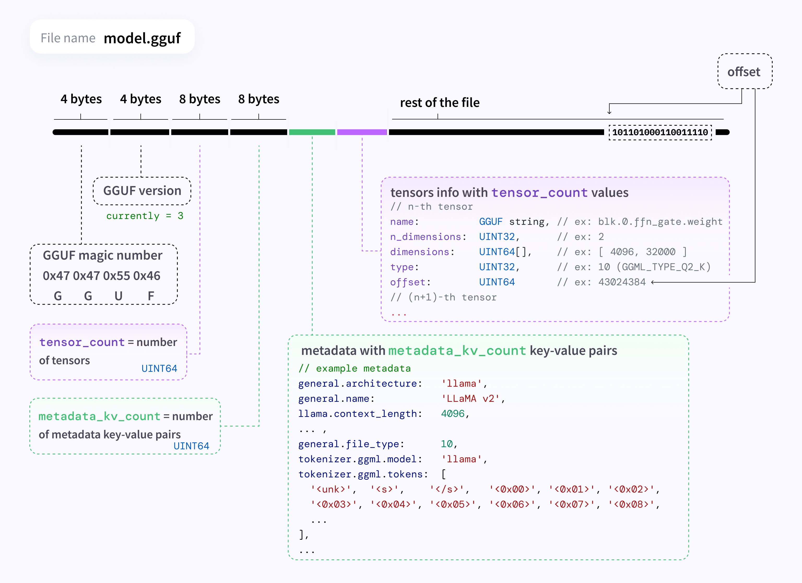

# GGUF（GPT-Generated Unified Format）簡介

GGUF 是一種專為大型語言模型（LLM）推論所設計的檔案格式，由先前的 GGML 格式發展而來，用於高效儲存和部署模型。在 2023 年 8 月由 Llama.cpp 專案引入後，GGUF 已成為取代 GGML 的新標準。它將模型的參數（權重）與額外的中繼資料整合在單一檔案中，以方便在各種裝置（包括一般消費級硬體）上快速載入與執行模型。

## GGUF 與 GGML 的比較

| 特性        | GGML           | GGUF               |
|------------|----------------|--------------------|
| 自包含性     | ❌            | ✅                 |
| 設計擴充性   | 低             | 高                  |
| 記憶體映射   | 有             | 有（更快）           |
| 量化支援     | 有             | 有（更完整）         |

## GGUF 格式的特性

GGUF 作為新一代格式，具有以下主要特性:

- `自包含性`: GGUF 檔案內含模型所需的`所有資訊`。除了權重張量，本身還帶有模型配置、中繼資料等，使其具有自我描述性。換言之，使用 GGUF 檔案時，不需要依賴任何外部設定檔或額外資訊即可正確載入模型。

- `單一檔案`: 每一個 GGUF 模型即是一個二進位單一檔案，方便分發與管理。​GGUF 將模型的所有資訊（架構、權重、超參數等）全封裝在一個 `.gguf` 檔案中，方便部署和分享。相較於需分散多個檔案（例如模型權重檔、配置檔、tokenizer檔案等）的格式更為簡潔。

- `包含模型結構與參數`: ​GGUF 檔案內含模型的結構定義和訓練後的權重，無需額外的配置檔案。

- `非執行檔格式`: ​GGUF 本身不是可執行檔案，需要透過支援 GGUF 的推理引擎（如 llama.cpp、Ollama 等）來執行。

- `可轉換性`: GGUF 支援從其他模型格式轉換而來，也可以轉回標準格式以進行訓練或微調。Hugging Face 提供了將 PyTorch/HuggingFace 格式模型轉換為 GGUF 的官方腳本（如convert-hf-to-gguf.py），方便地生成 GGUF 檔案。同樣地，如果需要對模型進行微調，亦可透過工具將 GGUF 檔載入後還原為全精度模型參數進行訓練，再重新匯出為 GGUF。舊有的 GGML 格式模型也能透過重新轉換量化的方式升級到 GGUF 格式。

- `支援量化`: GGUF 原生支援多種權重量化格式，使用低位元精度來大幅縮減模型大小與記憶體佔用，從而讓大型模型能在資源受限的裝置上運行。詳細的量化類型請參考下節說明。

- `擴充與相容性`: GGUF 以鍵值對形式儲存中繼資料，具有良好的可擴充性。開發者可以在格式中增加新的欄位來儲存更多模型資訊，而不會影響舊有讀取程式對既有欄位的解析。這種設計避免了頻繁的破壞性更新，提高了模型檔案格式的穩定性。對於使用者而言，GGUF 模型檔案在不同版本的程式庫中應能維持相容或至少容易地透過轉換使用，保障了長期可用性。

##### 支援的量化方法

GGUF 支援多種不同位元寬度的權重量化方案，使用者可依照硬體資源和精度需求選擇適合的模型版本。以下列出其中主要的幾種量化類型及特性：

| 量化類型 | 位元 | 模型大小 | 推理速度 | 準確性 | 適用場景 |
|----------|------|-----------|-----------|---------|-----------|
| Q2_K     | 2    | 最小      | 最快      | 低      | 內存非常有限 |
| Q4_K     | 4    | 小        | 快        | 中      | 一般用途 |
| Q5_K     | 5    | 中        | 中        | 高      | 效能與準確平衡 |
| Q8_0     | 8    | 大        | 較慢      | 最佳    | 硬體資源充足 |

### File Structure

GGUF 檔案格式採用二進位方式儲存，其內部分為檔案頭、模型中繼資料區塊以及模型張量數據三大部分:

- `檔案頭（Header）`: 檔案開頭包含格式識別碼和版本號等資訊，用於表明此檔案是 GGUF 格式以及版本。

- `中繼資料（Metadata）`: 緊隨檔案頭之後的是一系列以`鍵值對`形式存儲的中繼資料條目。這些鍵值對涵蓋了模型本身的各種說明性資訊和超參數設定。

- `模型權重張量`: 在中繼資料區塊之後，GGUF 檔案存放實際的模型參數張量數據。這些張量通常以緊湊的二進位形式儲存，順序和結構按照模型架構約定。由於 GGUF 支援不同精度/量化格式，張量數據部分可能包含經過量化壓縮的權重值。讀取時，根據中繼資料中記載的每個張量的名稱、維度和資料類型，程序會正確地將對應區域的二進位數據解析為模型的各項參數（如權重矩陣、偏置向量等）以重建模型。在需要進行微調或其他操作時，這些量化權重也可以被還原（例如轉換回 FP32）以供計算使用。

## 工具支援

- `llama.cpp`
- `GPT4All`
- `Ollama`
- `LangChain`
- `Hugging Face Hub`
