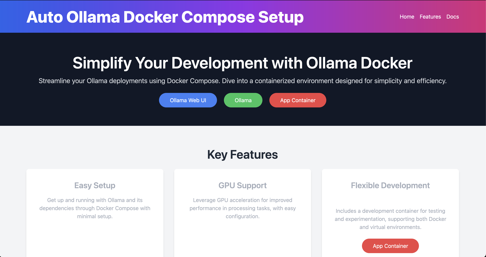

# Ollama WebUI - Advance

> ####  More information please see: [valiantlynx/ollama-docker](https://github.com/valiantlynx/ollama-docker)

這其實是另一個基於 [Open WebUI (以前稱為 Ollama WebUI)](https://github.com/open-webui/open-webui/tree/main) 的專案: [valiantlynx/ollama-docker](https://github.com/valiantlynx/ollama-docker)，他是多了一個可以管理 LLM runners (包誇 Ollama) 和 Open WebUI 的頁面，而且也可以 debug 此 App container (藉由微軟的 [debugpy](https://github.com/microsoft/debugpy))，如下所示:



## Quickstarts

1. Clone the Docker Compose repository:

    ```sh
    git clone https://github.com/valiantlynx/ollama-docker.git
    ```

2. Change to the project directory:

    ```sh
    cd ollama-docker
    ```

3. Start Ollama and its dependencies using Docker Compose:


   ```sh
   docker-compose up -d
   ```

啟動後，我們可以打開 http://0.0.0.0:8000，然後即可連至 `Open WebUI (Ollama WebUI)`。
