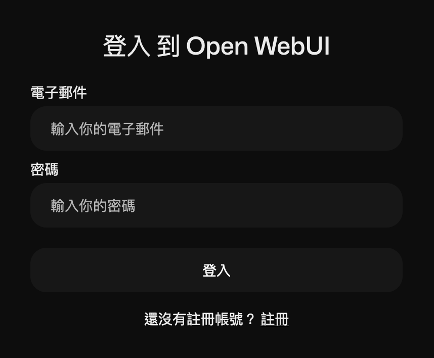
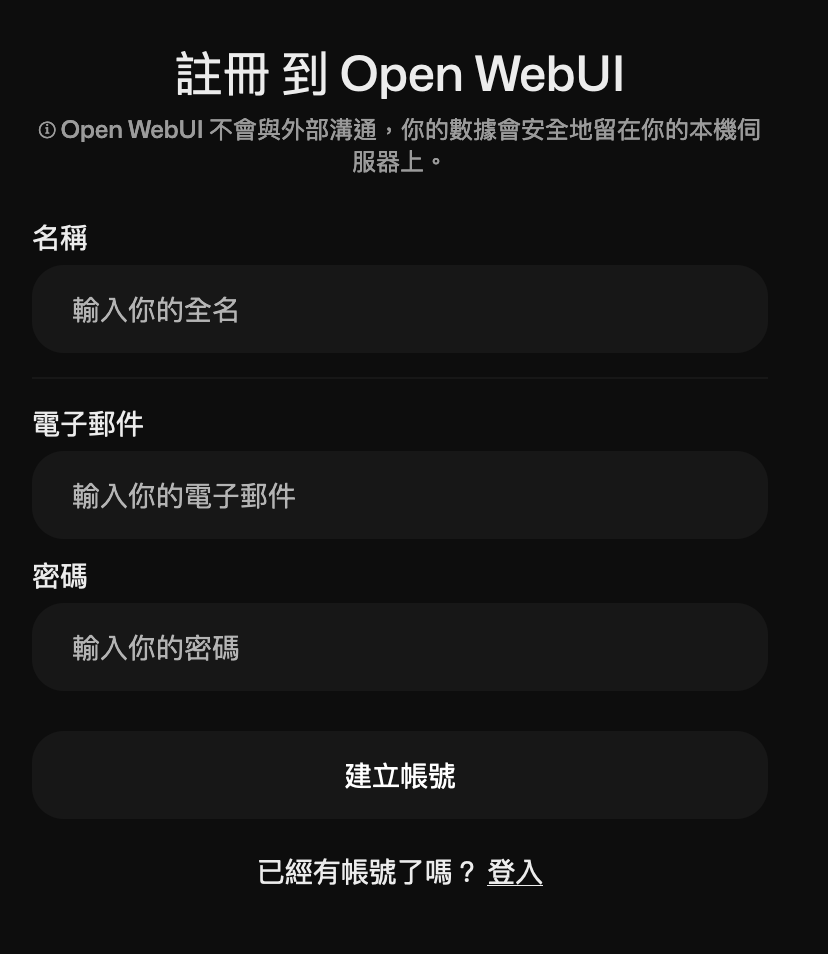
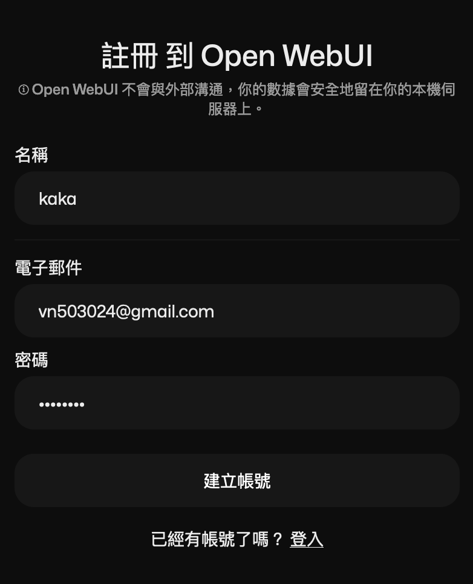
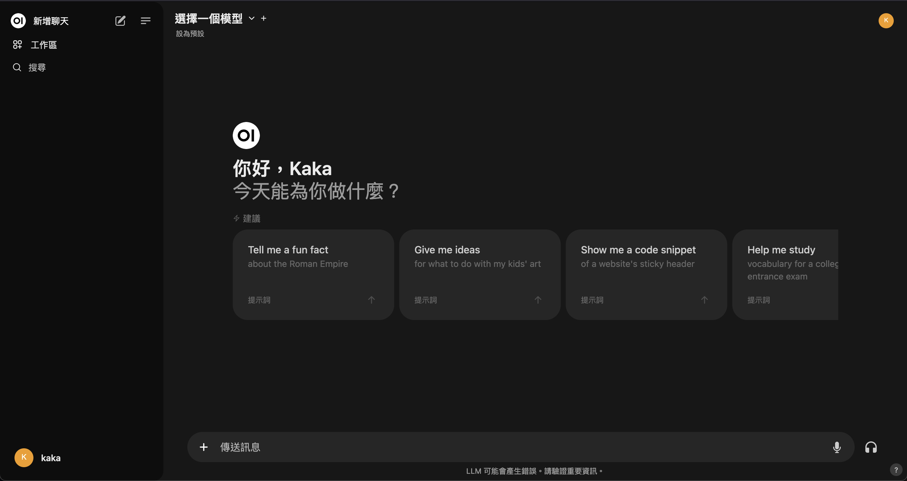
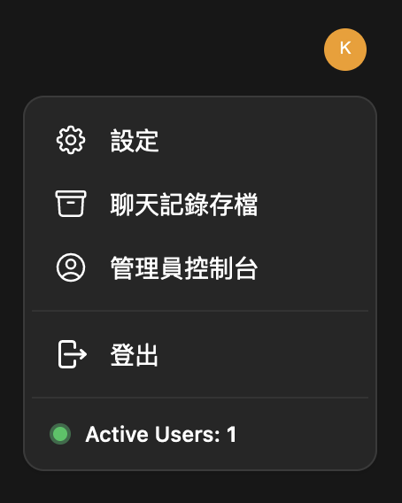
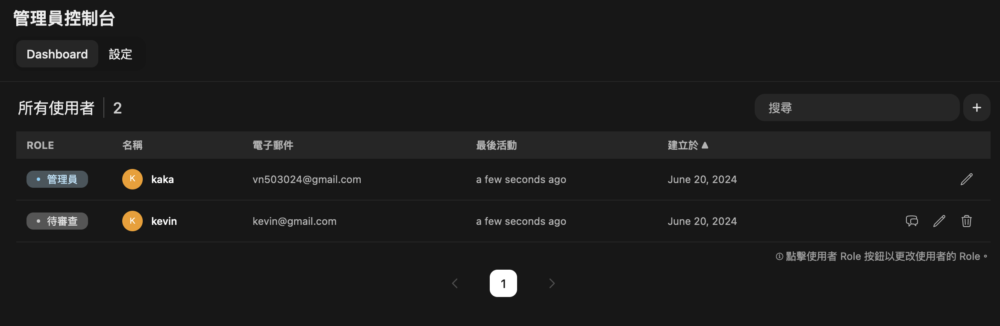

# Ollama WebUI

> ####  More information please see: [open-webui/open-webui ](https://github.com/open-webui/open-webui)

[Open WebUI (以前稱為 Ollama WebUI)](https://github.com/open-webui/open-webui/tree/main) 就是一個可以架在自己的機器上面的 WebUI，它支援多種 LLM runners，包誇 Ollama 和 OpenAI-compatible APIs

## Quickstarts

### If Ollama is on your computer, use this command:

```sh
$ docker run -d -p 8080:8080 --add-host=host.docker.internal:host-gateway -v open-webui:/app/backend/data --name open-webui --restart always ghcr.io/open-webui/open-webui:main
```
### Start Ollama and WebUI using Docker Compose:

```sh
$ docker-compose up -d
```

In [docker-compose.yml](./docker-compose.yaml):

```
volumes:
  ollama: {}
  open-webui: {}
```

上面代表 docker 幫你創造 ollams 跟 open-webui 的 volumes，這樣不用每次都指定實體位置，比較好維護。且我們可以透過:

- ``docker volume ls``: 指令查看是否真的存在。
- ``docker inspect [volume_name]``: 取得確切位置與相關資訊


啟動後，我們可以打開 http://0.0.0.0:8080，接著就可以看到 WebUI 的介面，如下所示:

#### 1. 登入畫面



> ##### 注意: 第一次啟動註冊的帳號及為管理員帳號，所以一定要先註冊！！！
>

#### 2. 註冊帳號



範例：



> 因為是啟動後第一次登入註冊，所以為管理員帳號

##### 3. 進入 WebUI，可以開始使用




##### 4. 如果管理註冊帳號 [Option]

畫面右上角人物頭像點下去:



然後點管理員控制台:


